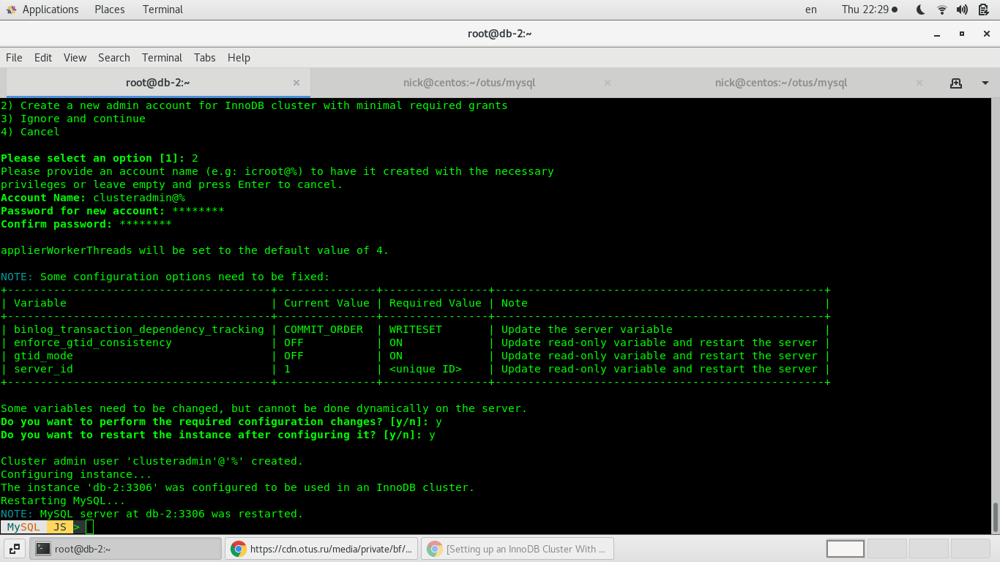
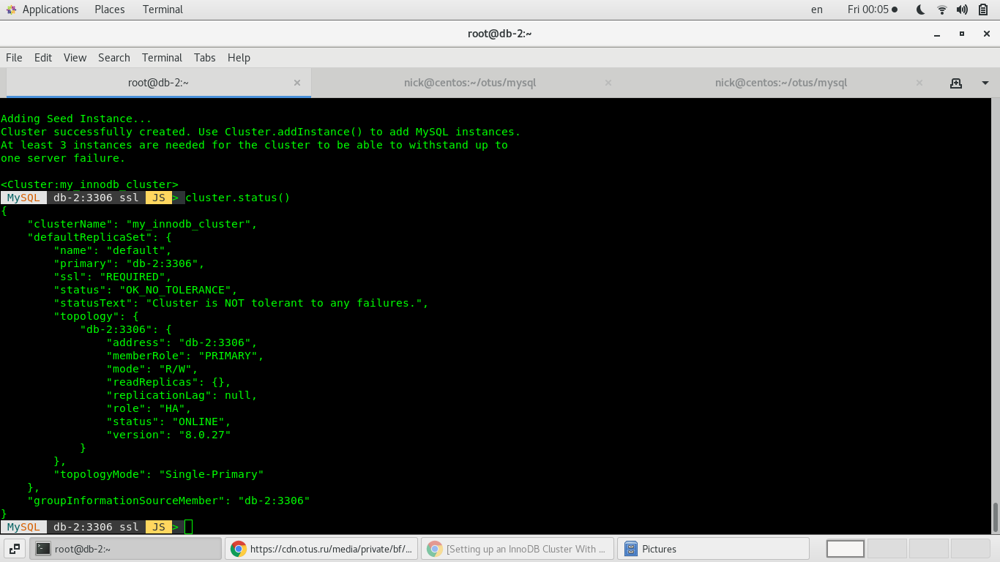
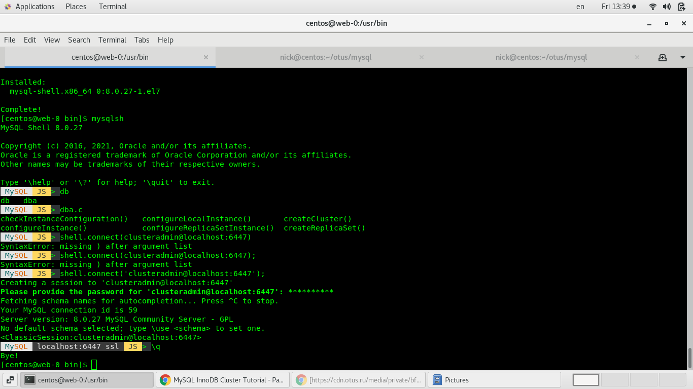

# ДЗ по теме MySQL - кластер

## Описание стенда
Prerequisites:
устновленные git, terraform, ansible, yc

Стенд состоит из двух частей:
Первая часть это запуск инфрасруктуры с помощью yandex cloud. Находится в папке terraform.
Вторая часть это установка и запуск сервера nginx на подготовленном сервере с помощью ansible. Находится в папке ansible.


В папке terraform написан код для развёртывания ВМ в облаке yandex.
Terraform состоит из следующих файлов:
```
main.tf - описание провайдера
balance.tf - описание узлов для балансировщиков
db.tf - описание узлов для СУБД
vpc.tf - описание сети
web.tf - описание web серверов
outputs.tf - вывод IP ВМ,  создание динамического inventory для ansible, создание файлов hosts используемых ansible и конфигурационного файла keealived
terraform.tfvars - присвоение значений переменным, которое не публикуется на git исходя из соображений безопасности.
Вместо него можно ознакомится с файлом terraform.tfvars.example
default_server.conf.tmpl - темплейт для формирование динамического конфигурационного файла keepalived
inventory.tmpl - темплейт для формирование динамического inventory для ansible
hosts.tmpl - темплейт для формирование динамическмх файлов hosts используемых ansible
variables.tf - объявление переменных
```

Вторая часть состоит из пьесы `setup_balance.yml`, которая запускает роли `db` `lb` и `web`
В роли `db` устанавливается и ghtldfhbntkmyj настраиваются 3 mysql-server(root password, wordpress db and user)
В роли `lb` устанавливается и настраивается keeepalived и nginx load balancer. Балансировка настраивается по внутреннему IP т.к. у yandex нет привязки внутреннего и внешнего IP, а на GCP у меня давно уже кончился триал период. А Vagrant  слишком долго траблшутить на моём железе и интернет-канале.
В роли `web` настраивается wordpress + selinux

## Запуск стенда
```
git clone https://github.com/NickVG/hl-linux-2021.git
cd 05-Nginx/terraform
terraform apply
cd ../ansible
echo "Need to wait VMs startup"
sleep 20
ansible-playbook setup_balance.yml
```

После запуска стенда:

На каждой ноде:

подключяемся к серверу через `mysqlsh`

```
MySQL  JS > dba.configureLocalInstance("root@localhost:3306");
Please provide the password for 'root@localhost:3306': ************
Save password for 'root@localhost:3306'? [Y]es/[N]o/Ne[v]er (default No):Y
```

Выбираем пункт 2



Далее подключаемся к узлу БД по hostname
```shell.connect('clusteradmin@db-2:3306');
cluster=dba.createCluster('my_innodb_cluster');
cluster = dba.createCluster('my_innodb_cluster2', {ipAllowlist: '10.128.0.46,10.128.0.47,10.128.0.48,innodb1,innodb2,innodb3'});
cluster = dba.getCluster()
-- разобрать кластер
cluster.dissolve({force:true})
cluster.addInstance('clusteradmin@innodb2:3306', {ipAllowlist: '192.168.10.10,192.168.10.11,192.168.10.12,db-0,db-1,db-2'});
cluster.addInstance('clusteradmin@innodb3:3306', {ipAllowlist: '192.168.10.10,192.168.10.11,192.168.10.12,db-0,db-1,db-2'});
cluster.status()
```


Далее переключаем в режим мультимастера

``` MySQL  db-2:3306 ssl  JS > cluster.switchToMultiPrimaryMode()
Switching cluster 'my_innodb_cluster' to Multi-Primary mode...

Instance 'db-2:3306' remains PRIMARY.
Instance 'db-1:3306' was switched from SECONDARY to PRIMARY.
Instance 'db-0:3306' was switched from SECONDARY to PRIMARY.

The cluster successfully switched to Multi-Primary mode.
```

Теперь осталось включить
Настройка mysql router на web серверах
my-sql-router уже раскатан с помощью ansible, осталось сделать следующее:

```
cd /usr/bin
./mysqlrouter --bootstrap  clusteradmin@db-2:3306 -d /home/centos/myrouter
~/myrouter/start.sh
```

проверяем через mysql-shell

