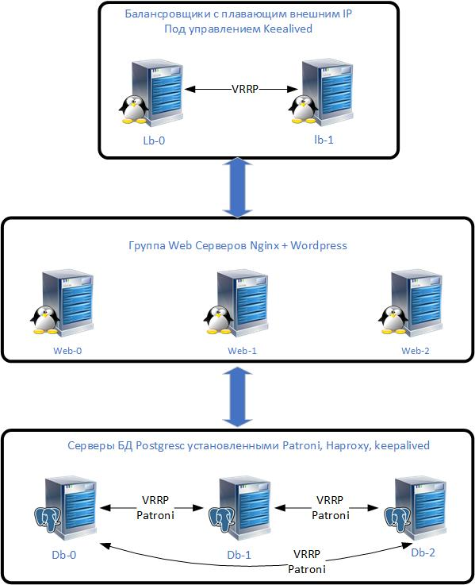
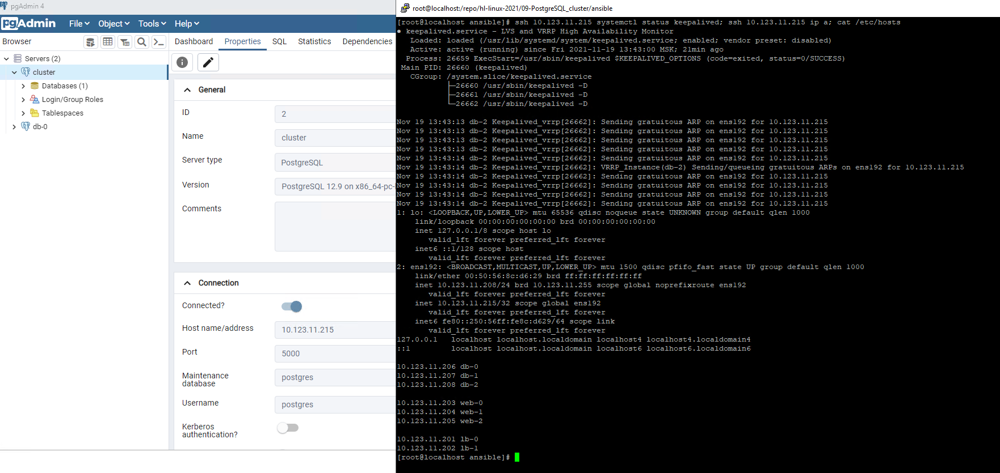

# ДЗ по теме Patroni

## Описание стенда
Prerequisites:
устновленные git, terraform, ansible, yc
ansible-galaxy collection install ansible.posix

Стенд состоит из двух частей:
Первая часть это запуск инфрасруктуры с помощью yandex cloud. Находится в папке terraform.
Вторая часть это установка и запуск web-сервиса на подготовленном сервере с помощью ansible. Находится в папке ansible.

## Схема стенда

Схема стенда:


В папке terraform написан код для развёртывания ВМ в облаке yandex.
Terraform состоит из следующих файлов:
```
main.tf - описание провайдера
balance.tf - описание узлов для балансировщиков
db.tf - описание узлов для СУБД
vpc.tf - описание сети
web.tf - описание web серверов
outputs.tf - вывод IP ВМ,  создание динамического inventory для ansible, создание файлов hosts используемых ansible и конфигурационного файла keealived
terraform.tfvars - присвоение значений переменным, которое не публикуется на git исходя из соображений безопасности.
Вместо него можно ознакомится с файлом terraform.tfvars.example
default_server.conf.tmpl - темплейт для формирование динамического конфигурационного файла keepalived
inventory.tmpl - темплейт для формирование динамического inventory для ansible
hosts.tmpl - темплейт для формирование динамическмх файлов hosts используемых ansible
variables.tf - объявление переменных
```

Вторая часть состоит из пьесы `setup_balance.yml`, которая запускает роли `db` `lb` и `web`
В роли `db` устанавливается и настраиваются 3 postgresql-server(root password, wordpress db and user)
В роли `lb` устанавливается и настраивается keeepalived и nginx load balancer. Балансировка настраивается по внутреннему IP т.к. у yandex нет привязки внутреннего и внешнего IP, а на GCP у меня давно уже кончился триал период. А Vagrant  слишком долго траблшутить на моём железе и интернет-канале.
В роли `web` настраивается wordpress + selinux

## Запуск стенда

```
git clone https://github.com/NickVG/hl-linux-2021.git
cd 05-Nginx/terraform
terraform apply
cd ../ansible
echo "Need to wait VMs startup"
sleep 20
ansible-playbook setup_balance.yml
```

## Настройка кластера

Роль db полностью подгтавливает poostgresql\patroni\haprooxy\keepalived для работы на трёх серверах:

```
install.yml - отвечает за установку софта
dbConfig.yml - создаёт софт линк для бинарников постгреса
etcd.yml - настроивает ETCD
patroni.yml - Настраивает patroni поверх ETCD
haproxy.yml - настраивает haproxy
keepalived.yml - настраивает keepalived
```

Роль web настраивает веб серверы
```
install.yml - отвечает за установку софта
selinux.yml - отвечает за настройку selinux
webconfig.yml - отвечает за настройку nginx
wordpress.yml - овечает за настройку wordpress и форка для работы с PostgreSQL
```
Роль lb настраивает балансировщики
```
install.yml - устанавливает и настраивает nginx и keepalived
```
Схема стенда:


Скиншоты:



Ссылки на всякий случай:

```
https://digitalis.io/blog/technology/part1-postgresql-ha-patroni-etcd-haproxy/
https://digitalis.io/blog/postgresql/deploying-postgresql-for-high-availability-with-patroni-etcd-and-haproxy-part-2/
https://www.techsupportpk.com/2020/02/how-to-set-up-highly-available-postgresql-cluster-ubuntu-19-20.html
https://habr.com/ru/post/322036/
https://medium.com/@shoaibhassan_/install-wordpress-with-postgresql-using-apache-in-5-min-a26078d496fb
```
